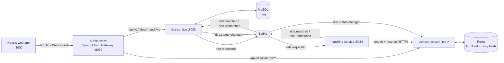
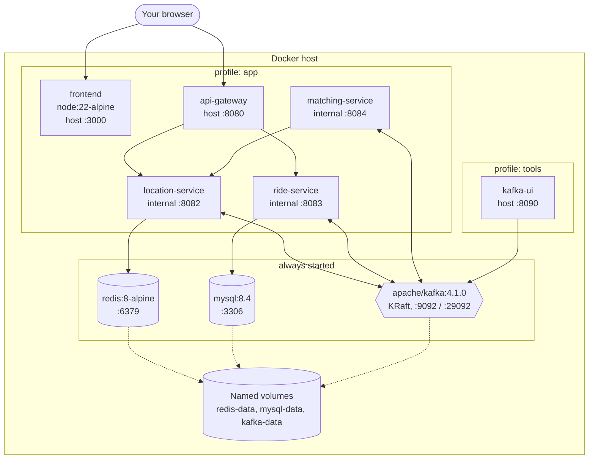
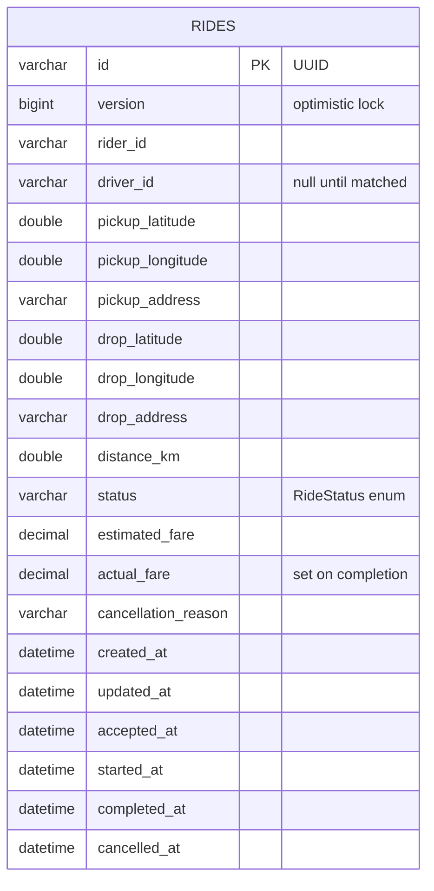
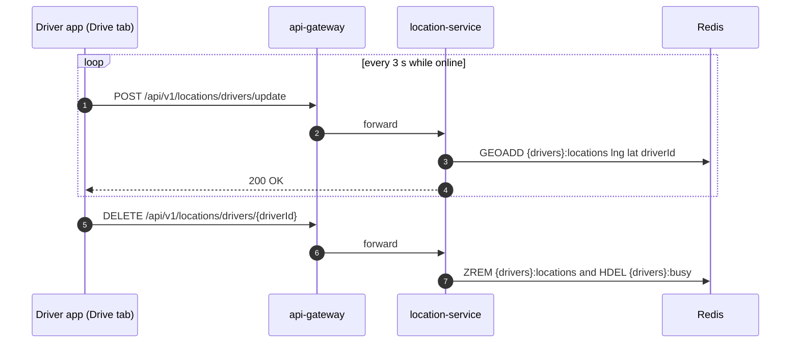
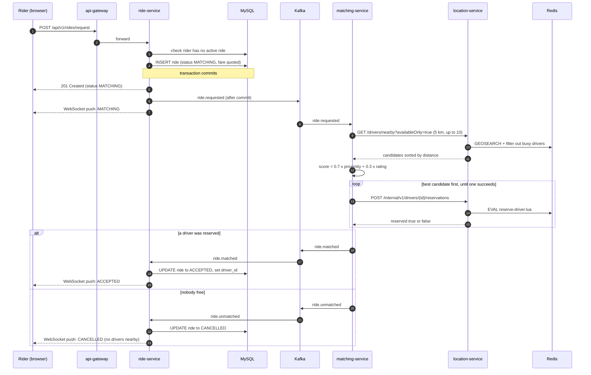
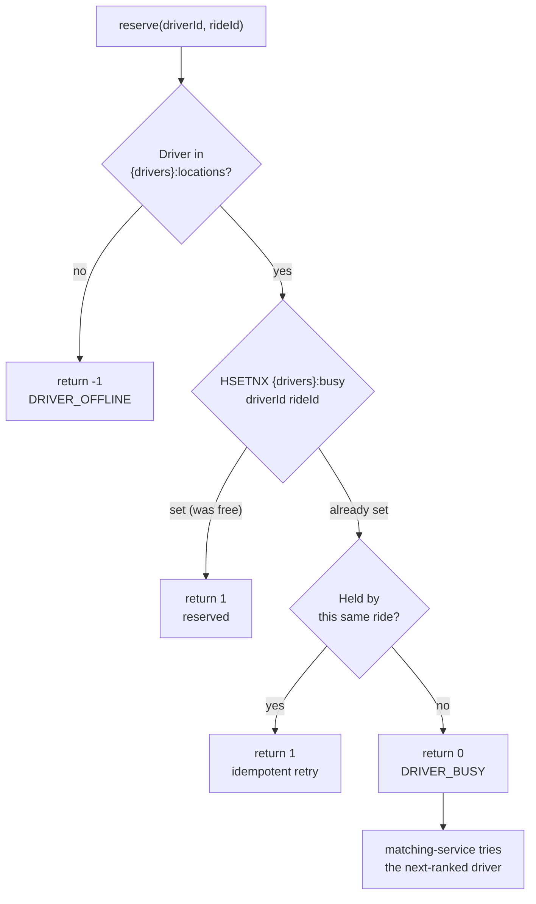
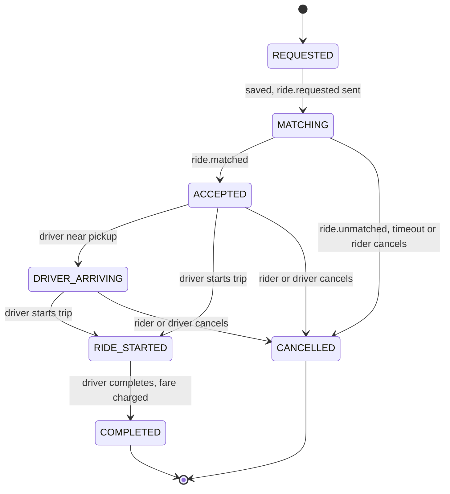
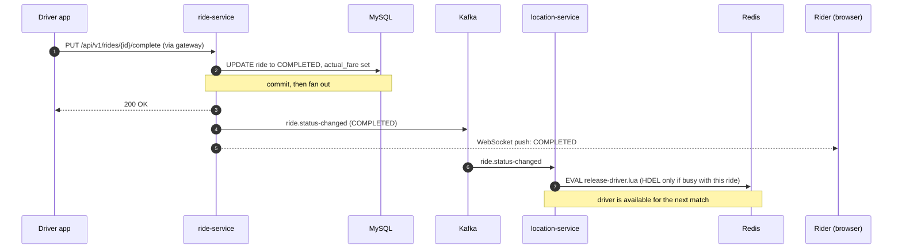
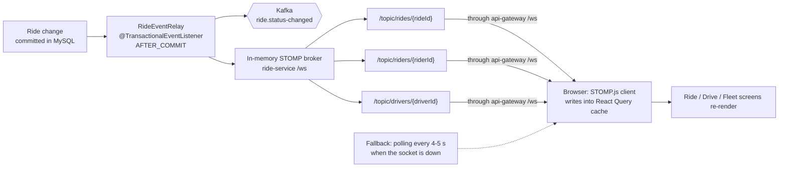
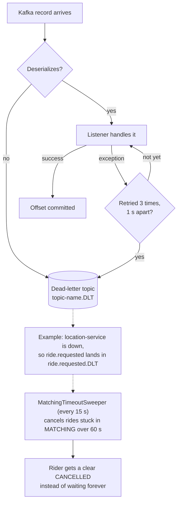

# RideShare: Event-Driven Ride-Hailing Platform

[](https://github.com/Ridzzz0Alam/rideSharing_system/actions/workflows/ci.yml)


A ride-hailing backend built as Spring Boot microservices, with a live map web app on top. Riders request trips, drivers stream their GPS position, a matching service picks the best nearby driver, and every ride change is pushed to the browser in real time.

**Stack:** Java 21 · Spring Boot 4.1 · Spring Cloud Gateway 5 · Apache Kafka 4 (KRaft) · Redis 8 (GEO) · MySQL 8.4 + Flyway · STOMP over WebSocket · Next.js 16 + React 19 + TypeScript · Docker Compose · GitHub Actions

> New here? Jump to **[Running locally](#running-locally)**, or follow **[docs/BUILD_GUIDE.md](docs/BUILD_GUIDE.md)** for the full step-by-step guide.

## Contents

- [Demo](#demo)
- [Architecture](#architecture)
  - [System overview](#system-overview)
  - [Services](#services)
  - [Container view](#container-view)
  - [Kafka topics](#kafka-topics)
  - [Data model](#data-model)
- [Data flows](#data-flows)
  - [1. Driver location updates](#1-driver-location-updates)
  - [2. Requesting a ride and matching a driver](#2-requesting-a-ride-and-matching-a-driver)
  - [3. Atomic driver reservation](#3-atomic-driver-reservation)
  - [4. Ride lifecycle](#4-ride-lifecycle)
  - [5. Completing a trip and freeing the driver](#5-completing-a-trip-and-freeing-the-driver)
  - [6. Real-time updates to the browser](#6-real-time-updates-to-the-browser)
  - [7. Failure handling](#7-failure-handling)
- [Engineering highlights](#engineering-highlights)
- [Running locally](#running-locally)
  - [Prerequisites](#prerequisites)
  - [Option A: everything in Docker](#option-a-everything-in-docker)
  - [Option B: services from your IDE](#option-b-services-from-your-ide)
  - [Check that it is healthy](#check-that-it-is-healthy)
  - [Demo walkthrough](#demo-walkthrough)
  - [Try the API with curl](#try-the-api-with-curl)
  - [Run the tests](#run-the-tests)
  - [Configuration](#configuration)
  - [Troubleshooting](#troubleshooting)
- [API reference](#api-reference)
- [Project structure](#project-structure)
- [Roadmap](#roadmap)

## Demo

<!-- Record the flow under "Demo walkthrough" (request ride -> matched -> drive -> complete), save it as docs/demo.gif, and uncomment the line below. -->
<!--  -->

## Architecture

### System overview

The browser talks only to the gateway. Services talk to each other through Kafka, except for one synchronous call: matching-service asks location-service for nearby drivers and reserves one over HTTP.



### Services

| Service | Port | Responsibility | Owns | Tech |
|---|---|---|---|---|
| **api-gateway** | 8080 | Single entry point. Routes REST and WebSocket traffic and handles CORS. Does not expose `/internal/**`. | Nothing (stateless) | Spring Cloud Gateway (WebFlux) |
| **location-service** | 8082 | Driver positions and availability. Nearby search, atomic driver reservation, release when a trip ends. | Redis | Redis GEOSEARCH, Lua scripts, Kafka consumer |
| **ride-service** | 8083 | Ride lifecycle state machine, fares, history, live push to browsers, matching timeout. | MySQL | JPA + MySQL, Flyway, Kafka, STOMP WebSocket |
| **matching-service** | 8084 | Scores nearby drivers and reserves the best one that is still free. | Nothing (stateless) | Kafka, Spring `RestClient` |
| **frontend** | 3000 | Ride, Drive and Fleet screens on a live Leaflet map. | Nothing | Next.js 16, React Query, STOMP.js |

Each service owns its own data. No service reads another service's database; they share information only through events and the gateway's public API.

### Container view

This is what `docker compose --profile app up` starts. Only the gateway and the frontend are published to your machine; the services are reachable only inside the Docker network.



All four Java services are built from one multi-stage `backend/Dockerfile` (`--build-arg SERVICE=...`) into layered, non-root images. The frontend uses Next.js standalone output.

### Kafka topics

Every record is keyed by `rideId`, so all events for one ride land on the same partition and are consumed in order. Each topic has 3 partitions.

| Topic | Producer | Consumer | Payload | When |
|---|---|---|---|---|
| `ride.requested` | ride-service | matching-service | Ride id, rider, pickup coordinates | A new ride is committed in `MATCHING` |
| `ride.matched` | matching-service | ride-service | Ride id, driver id, driver position, distance | A driver was reserved |
| `ride.unmatched` | matching-service | ride-service | Ride id, reason | No free driver within 5 km |
| `ride.status-changed` | ride-service | location-service | Ride id, rider, driver, new status | Any committed status change |
| `<topic>.DLT` | Error handlers | (manual inspection) | The failed record | A record failed 3 retries or could not be deserialized |

### Data model

**MySQL (ride-service).** One table, created by the Flyway migration `V1__create_rides.sql`. `version` drives optimistic locking.



Indexes: `(rider_id, created_at)` and `(driver_id, created_at)` for history pages, and `(status, updated_at)` for the matching-timeout sweeper.

**Redis (location-service).** Two keys. They share the `{drivers}` hash tag, so they sit in the same slot and the Lua scripts would also work on Redis Cluster.

| Key | Type | Contents | Written by |
|---|---|---|---|
| `{drivers}:locations` | GEO (sorted set) | `driverId` → longitude/latitude of every online driver | `GEOADD` on each location ping, `ZREM` when a driver goes offline |
| `{drivers}:busy` | Hash | `driverId` → `rideId` the driver is currently serving | `reserve-driver.lua` sets it, `release-driver.lua` clears it |

A driver is **available** when they are in `{drivers}:locations` and not in `{drivers}:busy`.

## Data flows

### 1. Driver location updates

The Drive screen sends the driver's position every 3 seconds. Location updates go straight to Redis and never touch Kafka or MySQL, so this high-frequency path stays cheap.



### 2. Requesting a ride and matching a driver

This is the core asynchronous flow. The HTTP request returns as soon as the ride is saved; the match arrives later over WebSocket.



### 3. Atomic driver reservation

Two rides can be matched at the same moment and both pick the same nearest driver. The reservation is a single Lua script, which Redis runs atomically, so only one of them can win.



Releasing a driver uses the same idea in reverse (`release-driver.lua`): delete the busy entry **only if it still points at this ride**. A late or duplicate "ride finished" event can therefore never free a driver who has already started another trip.

### 4. Ride lifecycle

Every transition goes through a method on the `Ride` entity, which checks it against this state machine and throws `409 Conflict` on an illegal move. A trip in progress cannot be cancelled, only completed.



A rider can have only one active ride (`REQUESTED` through `RIDE_STARTED`); a second request returns `409`.

### 5. Completing a trip and freeing the driver

ride-service never calls location-service directly. It announces the status change, and location-service reacts.



The same path frees the driver when an accepted ride is cancelled.

### 6. Real-time updates to the browser

After every committed change, `RideEventRelay` pushes the full ride to up to three STOMP destinations. The frontend keeps reference-counted subscriptions and writes each pushed ride straight into the React Query cache, so every screen showing that ride updates at once.



The header badge shows **Live** when the socket is connected and **Polling** when it has fallen back.

### 7. Failure handling



Other cases the code handles:

| Situation | What happens |
|---|---|
| A driver is matched after the rider already cancelled | ride-service ignores the match and emits a release, so the driver is freed. |
| `ride.matched` is delivered twice | The second delivery finds the ride already `ACCEPTED` with the same driver and does nothing. |
| Rider cancels at the same instant a match arrives | `@Version` optimistic locking makes one of the two updates fail; the Kafka side retries against fresh state. |
| location-service is slow | matching-service uses 2 s connect and 3 s read timeouts so the consumer thread is never stuck. |
| ride-service crashes between commit and Kafka send | The event is lost (a known trade-off, see [Roadmap](#roadmap)); the timeout sweeper still cancels the ride. |

## Engineering highlights

- **No double-booked drivers.** Reservation is a Redis Lua script that checks "online and free" and claims the driver in one atomic step, so concurrent matchers can never both win the same driver. Release is compare-and-delete, so a stale event cannot free a driver who has moved on to a new ride.
- **No lost updates.** The `Ride` entity is a rich domain model: every transition goes through methods that enforce the state machine, and `@Version` optimistic locking makes a concurrent "rider cancels" vs "driver matched" clash fail loudly instead of overwriting.
- **Events only for committed data.** Kafka and WebSocket messages are sent from a `@TransactionalEventListener(AFTER_COMMIT)`, so other services never act on a ride the database rolled back.
- **Resilient messaging.** `ErrorHandlingDeserializer` turns malformed messages into handled errors; `DefaultErrorHandler` retries 3 times and then routes to a dead-letter topic. Late or duplicate matches are handled idempotently.
- **Self-healing.** A scheduled sweeper cancels rides stuck in `MATCHING` past 60 s (for example if matching is down), so riders always get an answer.
- **Clean API contract.** Bean Validation on every input, RFC 9457 Problem Details for every error (404 / 409 / 400 with field errors), money as `BigDecimal`, timestamps as UTC `Instant`.
- **Deterministic, normalised scoring.** `0.7 × proximity + 0.3 × rating`, both scaled to 0–1, with a stable tie-breaker; ratings are behind an interface so a real driver-profile service can plug in.
- **Production plumbing.** Flyway-managed schema, Java 21 virtual threads, Actuator liveness/readiness probes, layered non-root Docker images, Kafka 4 in KRaft mode, CI for backend, frontend and images.

## Running locally

There are two ways to run the project:

- **Option A** runs everything in Docker with one command. Use it to see the app working.
- **Option B** runs only the infrastructure (Redis, MySQL, Kafka) in Docker, and the services from your IDE or terminal. Use it while developing or debugging.

### Prerequisites

| Tool | Version | Check with | Needed for |
|---|---|---|---|
| Docker Engine + Compose v2 (or Docker Desktop) | Recent | `docker compose version` | Both options |
| JDK | 21 or newer | `java -version` | Option B, running tests |
| Node.js | 22 LTS (20.9+ works) | `node -v` | Option B frontend |

You don't need to install Maven; the project ships the Maven Wrapper (`./mvnw`). Give Docker at least **6 GB of memory**: Kafka, MySQL and four JVMs together need it.

Clone the repository and create your local environment file:

```bash
git clone https://github.com/Ridzzz0Alam/rideSharing_system.git
cd rideSharing_system
cp .env.example .env    # database passwords; the defaults are fine locally
```

### Option A: everything in Docker

```bash
docker compose --profile app up --build
```

The first build takes several minutes while Maven and npm download dependencies; later builds use a cache. When you see `Started RideServiceApplication` in the logs, open **http://localhost:3000**.

| URL | What |
|---|---|
| http://localhost:3000 | Web app |
| http://localhost:8080 | API gateway |
| http://localhost:8090 | Kafka UI (add `--profile tools` to the command above) |

Stop with `Ctrl+C` or `docker compose --profile app down`. Add `-v` to also delete the database, Redis and Kafka data.

### Option B: services from your IDE

**1. Start the infrastructure**

```bash
docker compose up -d
docker compose ps      # wait until redis, mysql and kafka are "healthy"
```

This publishes Redis on 6379, MySQL on 3306 and Kafka on 9092. The services' default configuration already points at these addresses.

**2. Build the backend and run the unit tests**

```bash
cd backend
./mvnw clean verify
```

**3. Start the four services**, one per terminal, in this order:

```bash
./mvnw -pl location-service spring-boot:run
./mvnw -pl ride-service spring-boot:run
./mvnw -pl matching-service spring-boot:run
./mvnw -pl api-gateway spring-boot:run
```

In IntelliJ IDEA you can instead open `backend/pom.xml` as a project and run each `*Application` class. On first start, ride-service runs the Flyway migration that creates the `rides` table.

**4. Start the frontend**

```bash
cd frontend
npm install
cp .env.example .env.local
npm run dev
```

Open **http://localhost:3000**.

On Windows, use PowerShell or Git Bash and replace `./mvnw` with `mvnw.cmd`.

### Check that it is healthy

```bash
curl http://localhost:8080/actuator/health   # api-gateway
curl http://localhost:8082/actuator/health   # location-service (Option B only)
curl http://localhost:8083/actuator/health   # ride-service     (Option B only)
curl http://localhost:8084/actuator/health   # matching-service (Option B only)
```

Each should return `{"status":"UP",...}`. In Option A only the gateway is published to your machine.

### Demo walkthrough

1. **Fleet** tab: click **Add the 3 sample drivers**. Three cars appear in Bangalore.
2. **Ride** tab: click **Use the sample Bangalore trip**. The fare estimate appears.
3. Click **Request ride**. Within a second or two the status moves from "Finding a driver" to "Driver assigned", pushed over WebSocket. The badge in the panel header says **Live**.
4. Open the **Drive** tab in a second window. It follows the assigned driver automatically. Click **Go online**.
5. With "Drive automatically" ticked, the car drives to the pickup. Click **Start trip** (on either the Ride or the Drive tab), let it drive to the drop-off, and it completes.
6. Back on **Ride**, the trip shows as completed with the charged fare. On **Fleet**, the driver is free again.

Worth trying as well: take every driver offline and request a ride (it is cancelled with "No drivers available near the pickup"), or request a second ride while one is active (you get a `409`).

### Try the API with curl

```bash
# Put a driver online
curl -X POST localhost:8080/api/v1/locations/drivers/update \
  -H 'Content-Type: application/json' \
  -d '{"driverId":"driver:9","latitude":12.9716,"longitude":77.5946}'

# Request a ride near that driver
curl -X POST localhost:8080/api/v1/rides/request \
  -H 'Content-Type: application/json' \
  -d '{"riderId":"rider:9","pickupLatitude":12.9716,"pickupLongitude":77.5946,"pickupAddress":"MG Road",
       "dropLatitude":12.9352,"dropLongitude":77.6245,"dropAddress":"Koramangala"}'

# A moment later it is ACCEPTED with driverId set
curl localhost:8080/api/v1/rides/rider/rider:9
```

Look inside the data stores:

```bash
docker compose exec redis redis-cli ZRANGE "{drivers}:locations" 0 -1
docker compose exec redis redis-cli HGETALL "{drivers}:busy"
docker compose exec mysql mysql -urideshare -prideshare ride_db -e "SELECT id, status, driver_id FROM rides"
```

### Run the tests

These are the same checks CI runs on every push:

```bash
cd backend && ./mvnw verify                                                    # unit tests, no Docker needed
cd ../frontend && npm ci && npm run lint && npm run typecheck && npm run build
cd .. && docker compose --profile app build                                    # all images
```

### Configuration

Every setting has a local default and can be overridden with an environment variable.

| Variable | Used by | Default |
|---|---|---|
| `REDIS_HOST`, `REDIS_PORT` | location-service | `localhost`, `6379` |
| `KAFKA_BOOTSTRAP_SERVERS` | location, ride, matching | `localhost:9092` |
| `DB_HOST`, `DB_PORT`, `DB_NAME` | ride-service | `localhost`, `3306`, `ride_db` |
| `DB_USERNAME`, `DB_PASSWORD` | ride-service | `rideshare`, `rideshare` |
| `LOCATION_SERVICE_URL` | matching-service, api-gateway | `http://localhost:8082` |
| `RIDE_SERVICE_URL`, `RIDE_SERVICE_WS_URL` | api-gateway | `http://localhost:8083`, `ws://localhost:8083` |
| `FRONTEND_ORIGINS` | api-gateway, ride-service | `http://localhost:3000` |
| `GATEWAY_URL` | frontend | `http://localhost:8080` |

Business settings live in each service's `application.yaml` under `rideshare.*`: fare (`base-fare`, `per-km`, `currency`), matching timeout, search radius and distance weight.

### Troubleshooting

| Symptom | Fix |
|---|---|
| `Port 3306 / 6379 / 9092 is already in use` | A local MySQL, Redis or Kafka is running. Stop it, or change the left-hand port in `docker-compose.yml`. |
| ride-service: `Access denied` or `Public Key Retrieval is not allowed` | The MySQL volume was created with other credentials. Run `docker compose down -v` and start again. |
| The badge says **Polling** instead of **Live** | The WebSocket can't connect. Check the gateway is up and `FRONTEND_ORIGINS` matches your browser URL. |
| Ride stays in "Finding a driver", then cancels after about a minute | matching-service isn't running or can't reach location-service; the timeout sweeper cancelled the ride. |
| Docker build is killed or very slow | Give Docker more memory (6 GB or more). |

More cases are covered in **[docs/BUILD_GUIDE.md](docs/BUILD_GUIDE.md#9-troubleshooting)**.

## API reference

All public endpoints go through the gateway at `http://localhost:8080`. Errors are returned as RFC 9457 Problem Details.

| Method | Path | Description |
|---|---|---|
| `POST` | `/api/v1/locations/drivers/update` | Driver location ping `{driverId, latitude, longitude}` |
| `GET` | `/api/v1/locations/drivers` | All online drivers with busy state |
| `GET` | `/api/v1/locations/drivers/nearby?latitude=&longitude=&radius=&availableOnly=` | Nearby drivers |
| `DELETE` | `/api/v1/locations/drivers/{driverId}` | Driver goes offline |
| `POST` | `/api/v1/rides/estimate` | Fare estimate |
| `POST` | `/api/v1/rides/request` | Request a ride (201) |
| `GET` | `/api/v1/rides/{rideId}` | One ride |
| `GET` | `/api/v1/rides/rider/{riderId}` | Rider history (latest 50) |
| `GET` | `/api/v1/rides/driver/{driverId}` | Driver history (latest 50) |
| `PUT` | `/api/v1/rides/{rideId}/arriving` · `/start` · `/complete` | Driver actions |
| `PUT` | `/api/v1/rides/{rideId}/cancel?reason=` | Cancel |
| `WS` | `/ws` (STOMP) | Live ride updates |

Internal only (not routed by the gateway): `POST /internal/v1/drivers/{driverId}/reservations` on location-service.

## Project structure

```
.
├── docker-compose.yml          # Infra by default; --profile app for everything
├── .github/workflows/ci.yml    # Backend verify, frontend lint/typecheck/build, Docker build
├── backend/                    # Maven multi-module reactor (Spring Boot 4.1 parent)
│   ├── pom.xml
│   ├── Dockerfile              # One layered image per service (--build-arg SERVICE=...)
│   ├── api-gateway/
│   ├── location-service/       # Redis repository + Lua scripts in resources/scripts
│   ├── ride-service/           # Domain model, Flyway migrations in resources/db/migration
│   └── matching-service/
├── frontend/                   # Next.js 16 app (Ride, Drive, Fleet screens)
└── docs/BUILD_GUIDE.md
```

## Roadmap

These are deliberate next steps, not oversights:

- **Authentication:** OAuth2/JWT at the gateway and role checks so only the assigned driver can start or complete a ride.
- **Transactional outbox:** persist events in the same transaction and relay them with Debezium, closing the small gap where a crash between commit and send drops an event.
- **Horizontal scaling of WebSockets:** replace the in-memory STOMP broker with a RabbitMQ broker relay.
- **Integration tests:** Testcontainers for MySQL, Redis and Kafka.
- **Observability:** Micrometer tracing with OpenTelemetry, Prometheus and Grafana dashboards.
- **API docs:** springdoc-openapi once a release officially supports Spring Boot 4.1.
- **Stale drivers:** expire drivers who stop sending location pings.
