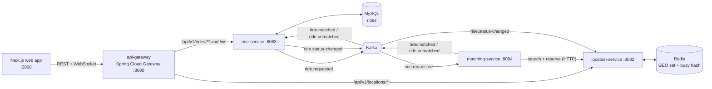

# RideShare: Event-Driven Ride-Hailing Platform

[](https://github.com/Ridzzz0Alam/rideSharing_system/actions/workflows/ci.yml)


A ride-hailing backend built as Spring Boot microservices, with a live map web app on top. Riders request trips, drivers stream their GPS position, a matching service picks the best nearby driver, and every ride change is pushed to the browser in real time.

**Stack:** Java 21 · Spring Boot 4.1 · Spring Cloud Gateway 5 · Apache Kafka 4 (KRaft) · Redis 8 (GEO) · MySQL 8.4 + Flyway · STOMP over WebSocket · Next.js 16 + React 19 + TypeScript · Docker Compose · GitHub Actions

> New here? Follow **[docs/BUILD_GUIDE.md](docs/BUILD_GUIDE.md)** to build and run everything step by step.

## Demo

<!-- Record the flow under "Quick start" (request ride -> matched -> drive -> complete), save it as docs/demo.gif, and uncomment the line below. -->
<!--  -->

## Architecture



| Service | Responsibility | Tech |
|---|---|---|
| **api-gateway** | Single entry point, routes REST and WebSocket traffic, CORS. Does not expose `/internal/**`. | Spring Cloud Gateway (WebFlux) |
| **location-service** | Driver positions and availability. Nearby search, atomic driver reservation, release on trip end. | Redis GEOSEARCH, Lua scripts, Kafka consumer |
| **ride-service** | Ride lifecycle state machine, fares, history, live push to browsers, matching timeout. | JPA + MySQL, Flyway, Kafka, STOMP WebSocket |
| **matching-service** | Scores nearby drivers and reserves the best one that is still free. | Kafka, Spring `RestClient` |

## Ride flow

1. The rider requests a ride. **ride-service** saves it as `MATCHING` and, **after the DB commit**, publishes `ride.requested`.
2. **matching-service** asks location-service for available drivers within 5 km, ranks them, and walks the ranking, trying to **atomically reserve** each driver until one succeeds.
3. It publishes `ride.matched` (or `ride.unmatched` if nobody is free). ride-service moves the ride to `ACCEPTED` (or `CANCELLED`).
4. Every committed change is pushed over WebSocket to `/topic/rides/{id}`, `/topic/riders/{id}` and `/topic/drivers/{id}`, and published to `ride.status-changed`.
5. When a ride is `COMPLETED` or `CANCELLED`, location-service consumes `ride.status-changed` and frees the driver.

```
REQUESTED -> MATCHING -> ACCEPTED -> DRIVER_ARRIVING -> RIDE_STARTED -> COMPLETED
                 |           |              |
                 +-----------+--------------+------> CANCELLED
```

## Engineering highlights

- **No double-booked drivers.** Reservation is a Redis Lua script that checks "online and free" and claims the driver in one atomic step, so concurrent matchers can never both win the same driver. Release is compare-and-delete, so a stale event cannot free a driver who has moved on to a new ride.
- **No lost updates.** The `Ride` entity is a rich domain model: every transition goes through methods that enforce the state machine, and `@Version` optimistic locking makes a concurrent "rider cancels" vs "driver matched" clash fail loudly instead of overwriting.
- **Events only for committed data.** Kafka and WebSocket messages are sent from a `@TransactionalEventListener(AFTER_COMMIT)`, so other services never act on a ride the database rolled back.
- **Resilient messaging.** `ErrorHandlingDeserializer` turns malformed messages into handled errors; `DefaultErrorHandler` retries 3 times and then routes to a dead-letter topic. Late or duplicate matches are handled idempotently.
- **Self-healing.** A scheduled sweeper cancels rides stuck in `MATCHING` past 60 s (for example if matching is down), so riders always get an answer.
- **Clean API contract.** Bean Validation on every input, RFC 9457 Problem Details for every error (404 / 409 / 400 with field errors), money as `BigDecimal`, timestamps as UTC `Instant`.
- **Deterministic, normalised scoring.** `0.7 × proximity + 0.3 × rating`, both scaled to 0–1, with a stable tie-breaker; ratings are behind an interface so a real driver-profile service can plug in.
- **Production plumbing.** Flyway-managed schema, Java 21 virtual threads, Actuator liveness/readiness probes, layered non-root Docker images, Kafka 4 in KRaft mode, CI for backend, frontend and images.

## API

All public endpoints go through the gateway at `http://localhost:8080`.

| Method | Path | Description |
|---|---|---|
| `POST` | `/api/v1/locations/drivers/update` | Driver location ping `{driverId, latitude, longitude}` |
| `GET` | `/api/v1/locations/drivers` | All online drivers with busy state |
| `GET` | `/api/v1/locations/drivers/nearby?latitude=&longitude=&radius=&availableOnly=` | Nearby drivers |
| `DELETE` | `/api/v1/locations/drivers/{driverId}` | Driver goes offline |
| `POST` | `/api/v1/rides/estimate` | Fare estimate |
| `POST` | `/api/v1/rides/request` | Request a ride (201) |
| `GET` | `/api/v1/rides/{rideId}` | One ride |
| `GET` | `/api/v1/rides/rider/{riderId}` | Rider history (latest 50) |
| `GET` | `/api/v1/rides/driver/{driverId}` | Driver history (latest 50) |
| `PUT` | `/api/v1/rides/{rideId}/arriving` · `/start` · `/complete` | Driver actions |
| `PUT` | `/api/v1/rides/{rideId}/cancel?reason=` | Cancel |
| `WS` | `/ws` (STOMP) | Live ride updates |

Internal only (not routed by the gateway): `POST /internal/v1/drivers/{driverId}/reservations` on location-service.

## Quick start

**Prerequisites:** Docker with Compose v2 and about 6 GB of free RAM. You don't need Java or Node installed; everything builds inside containers.

```bash
cp .env.example .env
docker compose --profile app up --build
# open http://localhost:3000
```

Then: **Fleet** → "Add the 3 sample drivers" → **Ride** → "Use the sample Bangalore trip" → "Request ride" → watch it get matched → **Drive** as the assigned driver to start and complete it.

Full instructions, local IDE setup and troubleshooting: **[docs/BUILD_GUIDE.md](docs/BUILD_GUIDE.md)**.

## Project structure

```
.
├── docker-compose.yml          # Infra by default; --profile app for everything
├── .github/workflows/ci.yml    # Backend verify, frontend lint/typecheck/build, Docker build
├── backend/                    # Maven multi-module reactor (Spring Boot 4.1 parent)
│   ├── pom.xml
│   ├── Dockerfile              # One layered image per service (--build-arg SERVICE=...)
│   ├── api-gateway/
│   ├── location-service/       # Redis repository + Lua scripts in resources/scripts
│   ├── ride-service/           # Domain model, Flyway migrations in resources/db/migration
│   └── matching-service/
├── frontend/                   # Next.js 16 app (Ride, Drive, Fleet screens)
└── docs/BUILD_GUIDE.md
```

## Roadmap

These are deliberate next steps, not oversights:

- **Authentication:** OAuth2/JWT at the gateway and role checks so only the assigned driver can start or complete a ride.
- **Transactional outbox:** persist events in the same transaction and relay them with Debezium, closing the small gap where a crash between commit and send drops an event.
- **Horizontal scaling of WebSockets:** replace the in-memory STOMP broker with a RabbitMQ broker relay.
- **Integration tests:** Testcontainers for MySQL, Redis and Kafka.
- **Observability:** Micrometer tracing with OpenTelemetry, Prometheus and Grafana dashboards.
- **API docs:** springdoc-openapi once a release officially supports Spring Boot 4.1.
- **Stale drivers:** expire drivers who stop sending location pings.
